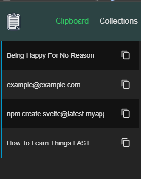
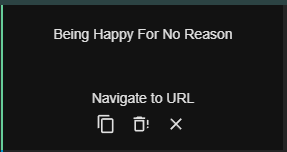
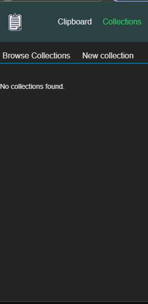
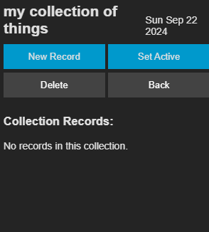
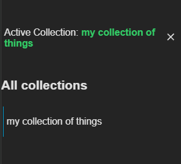
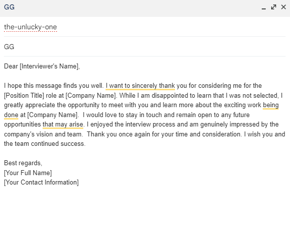

# Clipboard Collector

### Story

How many times have you needed to paste a previous copy but forgot that you had already utilized the clipboard for something else?
 On top of that, you might have forgotten the source, causing you to waste precious time searching for it.

**NO MORE!** Now you have the ability to track your latest clipboard activities and their origins.
Use right-click to paste them, and even create your own collections where you can store relevant data for your day-to-day activities.

---

### Usage

#### Clipboard

Simply copy whatever you desire, and it will appear in the **Clipboard** tab of the extension. From there, you can:

1. **Copy to clipboard**
2. **Go to the location of that text**
3. **Remove it** if you don't like it

Additionally, you can access your clipboard entries through the menu by right-clicking on an element and pasting the desired content.

---

#### Collections

To add more functionality, you can create your own collections and add elements to them for easy access. 
Furthermore, you can activate a collection to have quick access from the menu, reducing the effort needed to paste your items.

    

---

**How to Create a Collection**

1. #### **Create a collection**  
    be creative make as many as you want it is stored on your pc anyway

    

2. #### **Add records** 
    you can add as many records as you want but I suggest to keep it simple

    

3. #### **Set the collection as active** 
    this will let everybody know that this is your preferred collection at the moment

    

4. #### **Paste away** 
    same as clipboard

    

